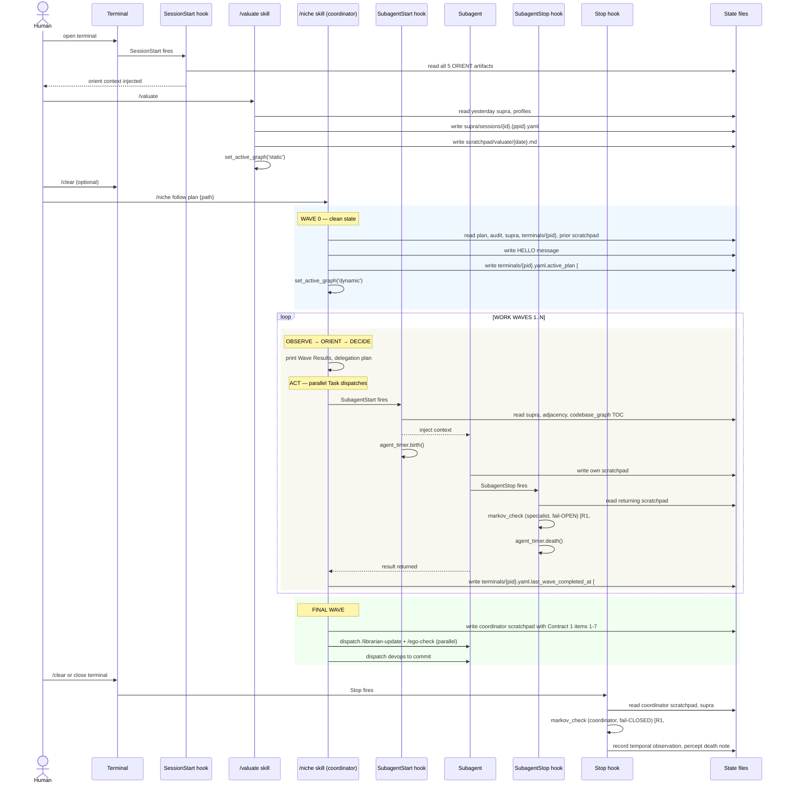
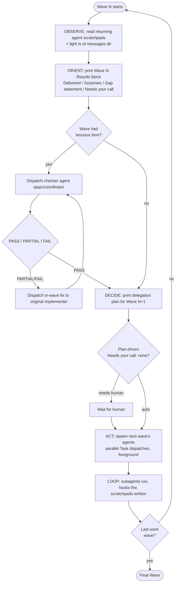
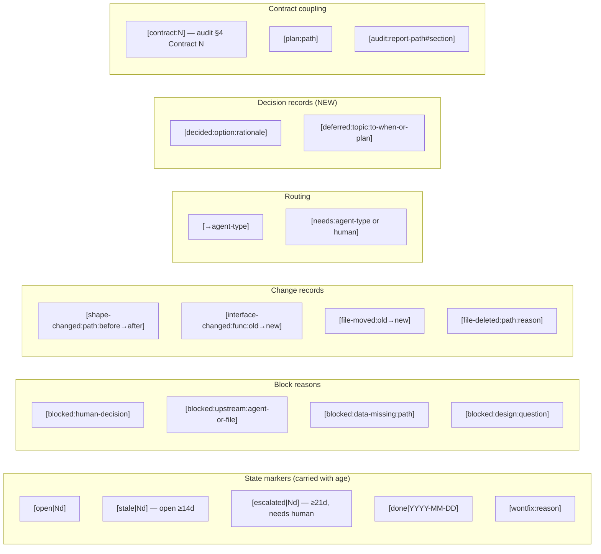
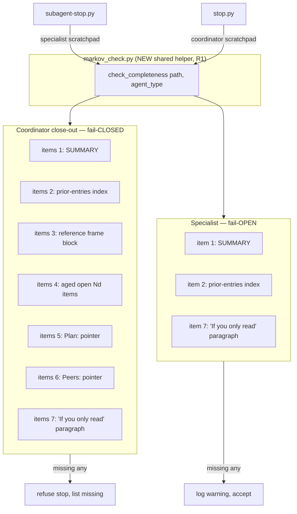

# Flywheel-Gyroscope Fix (2026-04-18)

| Field | Value |
|---|---|
| **Status** | ready to execute via `/niche` after `/clear` |
| **Mode** | meta-infra only — `.claude/`, `specs/`, `codebase_graph.md` (+ children). NO `stage*/`, `utils/`, `scripts/`, `data/` |
| **Effort** | high (xhigh allowed where contract correctness demands it; checker agents dispatched on tenuous deliverables) |
| **Deliverable** | THE integrated fix for the audit's ORIENT-substrate rot, end-to-end in one session |
| **Source** | `reports/2026-04-18-organizational-flywheel-audit.md` §3 (themes C, G, H) and §4 (contracts 1, 2, 3, 5) |
| **Invoke** | `/niche follow plan .claude/plans/2026-04-18-flywheel-gyroscope-fix.md` |

---

## 1. Why this plan exists

The audit produced 26 roadmap items. They split into two clusters:

1. **Map and meta-machinery** (this plan): items 1–7 + 23 + opportunistic 24. All inside `.claude/`, `specs/`, `codebase_graph.md`. Touches only documentation, rules, hooks, skills. Worst case: a poorly-worded contract — recoverable. Cannot break a pipeline.
2. **Territory** (later plans): `utils/paths.py` consolidation, sidecars, experiment ledger, archive index, repo-root cleanup. Each touches code/data; each gets its own plan with its own claimed_paths + qaqc gate.

This plan does cluster 1 — **all of it**. Hooks, rules, and skills are first-class redesignable targets here because they live entirely in the LLM-coordination layer; editing them does not touch any production data/code workflow.

The Markov contract is the linchpin. Without it, every cleanup we do today rots the moment the next session opens.

---

## 2. Scope

### 2.1 In scope — concrete items

| # | Action | Owner | Wave | Tenuous? |
|---|---|---|---|---|
| 1 | Write `specs/README.md` index (groups + status + one-line) | spec-writer | W1 | no |
| 2 | Add `## Status:` header to each of 17 specs | spec-writer | W1 | no |
| 3 | Update `coordinator-coordination.md` — point at `terminals/{pid}.yaml`, delete stale `sessions/`+`supra/` refs | coordinator-direct | W1 | no |
| 6 | Evict the 1200-word changelog paragraph from `codebase_graph.md` | librarian | W1 | no |
| 7 | Split `codebase_graph.md` into thin TOC root (≤200 lines) + 8 per-stage child files (≤500 lines each) under `codebase_graph/` | librarian | W2 | **YES** |
| 4 | Rewrite Signal Vocabulary section + add Markov Contract section in `multi-agent-protocol.md` | spec-writer | W2 | no |
| 5 | Build `markov_check.py` shared helper; wire into `subagent-stop.py` (fail-open) and `stop.py` (fail-closed) | devops | W3 | **YES** |
| 23 | Extend `terminals/{pid}.yaml` schema with `active_plan` + `last_wave_completed_at` fields; add helper functions to `coordinator_registry.py` | devops | W3 | no |
| 24 | (opportunistic) Daily archive sweep for `supra/sessions/` >30d and `coordinators/messages/` >7d — only if hook infra makes it trivial | devops | W3 | no |

### 2.2 Architectural redesigns (decided up front, not improvised)

These are first-class architectural moves — bigger than the audit's literal item list, but still inside `.claude/` so safe by construction.

- **R1 — Hook placement** (DECIDED by inspection 2026-04-18): `.claude/hooks/stop.py` already exists (218 lines, fires on the main agent's Stop event per `settings.json`) and already does coordinator close-out work. It IS the natural home for the coordinator-side `check_markov_completeness` gate. Architecture: shared helper `markov_check.py` is called by both `stop.py` (coordinator scratchpad, fail-closed) and `subagent-stop.py` (specialist scratchpad, fail-open). One implementation, two callers, two fail-modes.

- **R2 — `niche/SKILL.md` Wave 0 step 7 update**: extend the supra-states read step to also read `terminals/{pid}.yaml` for the new `active_plan` + `last_wave_completed_at` fields (gyroscope current-reading at the skill layer; mirror of #23 at the data layer).

- **R3 — `multi-agent-protocol.md` ≤30-line override mechanism**: the audit explicitly says "Length is not the cost; loss-of-state is." The override comment (`<!-- OVERRIDE: ... -->`) is currently informal. Make it a documented part of the protocol rule.

- **R4 — Contract 5 archive cron** (item 24): if existing hook infra has a daily-cron equivalent (or a `SessionStart` hook can run a "≥24h since last archive sweep" check), do it. If not, defer. Decision logged in W3.

- **R5 — Scratchpad signal vocabulary v2**: replace mood-words with structured tags (full spec in §3.4 Signal Vocabulary). Bundled into item #4's spec-writer task.

### 2.3 Out of scope — explicitly deferred

- Item 8 (`utils/paths.py` consolidation) → `2026-XX-XX-stage3-paths-consolidation.md`
- Items 9, 10, 11, 12 (sidecars, experiment ledger, figure provenance) → `2026-XX-XX-act-orient-crystallization.md`
- Items 13–21 (archive index, repo-root cleanup, data-code violations) → `2026-XX-XX-housekeeping.md`
- Item 22 (claim-narrowing rule decision) → surfaced as Open Question for human at end of W4
- Items 25, 26 (specific spec triage) → after item 2 lands

### 2.4 Tenuous-deliverable protocol

Items #5 and #7 (marked YES above) get an extra checking agent dispatched after the implementer returns, BEFORE advancing to the next wave. The checker reads the implementer's scratchpad + the modified files and writes PASS/PARTIAL/FAIL. PARTIAL or FAIL → in-wave fix dispatch. Only advance when PASS.

### 2.5 Architectural-edit protocol

Redesigns R1–R5 are decided up front in this plan. If during execution a NEW architectural mismatch is discovered, the coordinator's options are: (a) pause and ask the user to add it to the plan, OR (b) defer to a future plan with a `[open|0d]` item. **No silent in-session redesigns.**

---

## 3. Diagrammatic Flow Analysis

Reproducible workflow specification. Every architectural decision lands somewhere on these diagrams. A future session reading this plan should be able to point at any state file or hook and know what reads/writes it.

### 3.1 Lifecycle sequence — full session arc with hooks



### 3.2 OODA wave-internal flow (one wave)



### 3.3 State files — read/write matrix

| State file | Written by | Read by | Contract | Notes |
|---|---|---|---|---|
| `supra/sessions/{id}.{ppid}.yaml` | `/valuate`, `stop.py` | `/niche` Wave 0, `subagent-context.py`, `session-start.py` | C5.1 | Reference frame; archive >30d |
| `coordinators/terminals/{pid}.yaml` | `/niche` Wave 0, item 23 helpers | `session-start.py`, `/sync` | C5.3 | + `active_plan`+`last_wave_completed_at` after #23 |
| `coordinators/session-{id}.yaml` | `/niche`, `coordinator_registry` | peer coordinators, `session-start.py` | C5.2 | Claim-narrowing rule (item 22 — open Q) |
| `coordinators/messages/{date}/` | `/niche` HELLO, `/sync` | other terminals, `session-start.py` | C5.5 | Archive >7d (item 24, R4) |
| `scratchpad/valuate/{date}.md` | `/valuate` | `session-start.py` | C5.4 | Per-session valuate trace |
| `scratchpad/{agent}/{date}-{sid}.md` | each agent | next agent of same type, `subagent-context.py` (adjacency), `subagent-stop.py` | C1 | Markov-complete final entry required |
| `scratchpad/coordinator/{date}-{sid}.md` | coordinator | `stop.py` (markov check), `session-start.py`, next coordinator | C1 | Fail-CLOSED if items 1–7 missing |
| `scratchpad/librarian/codebase_graph.md` | librarian only | all agents (read), Explore | C2 | ≤200 lines after split (#7) |
| `scratchpad/librarian/codebase_graph/*.md` | librarian only | all agents (read) | C2 | Each ≤500 lines, last-verified stamp |
| `specs/README.md` + `specs/*.md` | spec-writer only | all agents | C3 | Status header on every spec (#2) |
| `.claude/plans/*.md` | spec-writer, coordinator | `/niche` Wave 0 | C4 | Frozen intent |

### 3.4 Signal Vocabulary v2 (R5 — bundled into item #4)

The current single-word signals (BLOCKED / URGENT / CRITICAL / BROKEN / SHAPE_CHANGED / INTERFACE_CHANGED / DEPRECATED / NEEDS_TEST) are mood-words — they signal *attention is needed* but not *what action* nor *by whom*. Replaced with structured tags keyed to **actionability + routing + contract coupling**:



The hook-side regex check (item #5) must recognize the new tags — specifically `\[open\|\d+d\]` is what Contract 1 item 4 (aged open items) requires.

### 3.5 Markov-completeness contract — enforcement points



---

## 4. Wave Plan

Order is fixed. Each wave's agents run in parallel; waves run sequentially. Tenuous waves dispatch a checker after implementers return.

### Wave 0 — Clean State (mandatory)

1. `git status` — confirm clean tree (last commit `58958ef`).
2. Read the audit at `reports/2026-04-18-organizational-flywheel-audit.md` — §3 themes C/G/H + §4 contracts 1, 2, 3, 5.
3. Read supra session at `.claude/supra/sessions/willowy-turning-timber-2026-04-18.{ppid}.yaml`.
4. Read prior coordinator scratchpad at `.claude/scratchpad/coordinator/2026-04-18-golden-standing-creek.md` (golden-standing-creek did the audit; this session executes the fix).
5. Narrow `claimed_paths` to: `.claude/rules/**`, `.claude/skills/**`, `.claude/hooks/**`, `.claude/scratchpad/librarian/codebase_graph.md`, `.claude/scratchpad/librarian/codebase_graph/**`, `.claude/coordinators/terminals/**`, `specs/**`. NOT `stage*/`, `utils/`, `scripts/`, `data/`.
6. HELLO broadcast. Mission: "Execute audit's flywheel-gyroscope fix (items 1–7+23+R1–R5)."
7. Confirm to user: "Plan loaded, audit re-read. Starting Wave 1." Auto-advance (plan-driven gating).

### Wave 1 — Parallel ORIENT moves (3 agents, no tenuous items)

| Agent | Task | Acceptance criteria |
|---|---|---|
| `spec-writer` | **Items #1+#2 bundled.** (a) Read all 17 specs to verify status. (b) Write `specs/README.md`: index grouped by functional area (pipeline / scripts / Claude-infra), columns `filename | status | one-line summary`. Statuses: Active / Implemented / Superseded (→ successor) / Draft / Historical. (c) For each spec, add a `## Status: {status}` header on line 2–3. For Superseded specs, add a top-line pointer block. Use spec-writer's Wave 1 audit verdict as starting point — materialize, don't re-audit. | (1) `specs/README.md` lists all 17 (count check). (2) Every spec file has a Status header. (3) Every Superseded spec points at successor. (4) No content rewrites — metadata only. (5) Markov-complete scratchpad. |
| `librarian` | **Item #6 — eviction only.** Identify the 1200-word changelog paragraph at the head of `.claude/scratchpad/librarian/codebase_graph.md`. Delete it. Replace with one-line stub: `<!-- last-verified: 2026-04-18 by librarian (changelog evicted per audit §Theme G; see git log for history) -->`. Do NOT split into child files yet — that's W2. | (1) Changelog gone. (2) Stub line present. (3) File reduced by ~1200 words / ~50KB. (4) `.bak-2026-03-29` left alone. (5) Markov-complete scratchpad. |
| `coordinator` (self) | **Item #3.** Update `.claude/rules/coordinator-coordination.md` Files table: replace stale `coordinators/sessions/{id}.{ppid}` and `coordinators/supra/{id}.{ppid}` references with `terminals/{pid}.yaml`. Verify against disk first. Coordinator-direct edit per Pre-Edit Gate. | (1) Stale paths removed. (2) `terminals/{pid}.yaml` referenced with correct schema (post-#23 fields if landed). (3) Disk-verified before edit. (4) Logged in coordinator scratchpad. |

### Wave 2 — Tenuous deliverables (implementer + checker pattern)

**Implementers (parallel):**

| Agent | Task | Acceptance criteria |
|---|---|---|
| `librarian` | **Item #7 — codebase_graph split (TENUOUS).** Per audit Contract 2: split (post-eviction) `codebase_graph.md` into thin TOC root (≤200 lines) + 8 child files under `.claude/scratchpad/librarian/codebase_graph/`: `utils.md, stage1.md, stage2.md, stage3.md, scripts.md, infrastructure.md, data_artifacts.md, known_issues.md`. Each child ≤500 lines, with `<!-- last-verified: 2026-04-18 by librarian -->` on line 1, lists every module in its domain with path + one-line contract. Root contains: cross-stage interface contracts, TOC of children, H3 compliance audit table, region_id index contracts table. NO changelog, NO round numbers. RESOLVE the 13 known drift items from librarian Wave 1 audit while splitting (correct or remove, don't carry forward). Print to scratchpad: which lines went to which child file. | (1) Root ≤200 lines, has TOC + interface contracts + H3 audit + region_id contracts. (2) 8 child files exist, each ≤500 lines, each with last-verified stamp. (3) Total post-split ≤2100 lines (vs 3228 pre-split). (4) The 13 drift items resolved, not carried. (5) Markov-complete scratchpad with line→file mapping. |
| `spec-writer` | **Item #4 + R3 + R5.** Edit `.claude/rules/multi-agent-protocol.md`: (a) REWRITE the existing `## Signal Vocabulary` section with the structured tags from §3.4 (state markers, block reasons, change records, routing, decision records, contract coupling). Mark the old single-word signals deprecated. (b) ADD new section `## Markov-Completeness Contract (Coordinator Close-Out)` listing Contract 1 items 1–7 verbatim from audit §4: SUMMARY, prior-entries, reference frame, aged `[open\|Nd]`, Plan pointer, Peers pointer, "If you only read this entry" paragraph. Specialist scratchpads need only items 1, 2, 7. (c) DOCUMENT the override mechanism (`<!-- OVERRIDE: ... -->`) as a formal escape from the ≤30-line guideline (R3). (d) STATE fail mode: specialist fail-open (warn), coordinator close-out fail-closed (refuse). Do NOT touch other sections. | (1) Signal Vocabulary v2 complete with all 6 tag categories. (2) Markov contract section added with items 1–7 verbatim. (3) Override mechanism formally documented. (4) Fail mode stated for both tiers. (5) Old single-word signals marked deprecated. (6) Markov-complete scratchpad. |

**Checkers (parallel after implementers return):**

| Checker | Verifies | Acceptance criteria |
|---|---|---|
| `qaqc` | **codebase_graph split checker.** Read every file under `.claude/scratchpad/librarian/codebase_graph/` + the new root. Verify: (a) root ≤200 lines, (b) every child ≤500 lines, (c) every child has the last-verified stamp, (d) the union of children covers what the pre-split file covered (spot-check 5 random module entries from the librarian's line→file mapping), (e) zero changelog content, (f) the 13 drift items are corrected/removed, not present-as-stale. | PASS = all six checks. PARTIAL → list which checks failed. Markov-complete scratchpad. |
| `coordinator` (self) | **Markov-contract sanity check.** Read the spec-writer's modified `multi-agent-protocol.md`. Verify Items 1–7 present, override mechanism formal, fail mode explicit, signal vocabulary v2 complete. If discrepancy → flag for in-wave fix before W3. | Verified by inspection. Result printed in W2 ORIENT report. |

If qaqc returns PARTIAL/FAIL on the split → dispatch `librarian` again with specific findings as fix-spec. Re-verify. Only advance to W3 when split passes.

### Wave 3 — Hook + session-state extension (gyroscope wiring)

**Implementer (single agent — bundled because all changes are in `.claude/hooks/`):**

| Agent | Task | Acceptance criteria |
|---|---|---|
| `devops` | **Items #5 + #23 + opportunistic #24, plus R1, R2, R4.** (#5+R1) Create `.claude/hooks/markov_check.py` with `check_completeness(scratchpad_path, agent_type)`. Coordinator path: check items 1–7 via regexes — SUMMARY (`<!-- SUMMARY:`), prior-entries (`(?i)Prior entries:`), reference frame (`mode=\w+\s+speed=\d`), aged open (`\[open\|\d+d\]`), Plan pointer (`(?im)^Plan:\s+\S`), Peer pointer (`(?im)^Peers?:`), final paragraph heading (`(?im)^##\s+If you only read`). Missing → return list of missing items. Specialist path: check items 1, 2, 7 only. Wire into `subagent-stop.py` (call with agent_type='specialist', fail-OPEN: log warning, exit 0). Wire into `stop.py` (call with agent_type='coordinator', fail-CLOSED: print missing items to stderr + emit blocking output). Idempotent. (#23) Extend `coordinator_registry.py` so `terminals/{pid}.yaml` writer accepts new optional fields `active_plan: str|null` and `last_wave_completed_at: iso8601|null`. Add helpers `set_active_plan(path)` and `mark_wave_complete()`. Schema extension non-breaking — old fields preserved, new default null. (#24+R4) If trivial: add daily-archive logic to `session-start.py` (check ≥24h since last sweep, archive `supra/sessions/*.yaml` >30d to `supra/sessions/archive/`, archive `coordinators/messages/{date}/` >7d to `coordinators/messages/archive/`). If non-trivial → defer to housekeeping plan; note in scratchpad. (R2) Edit `.claude/skills/niche/SKILL.md` Wave 0 step 7: extend the supra-states read step to also read `terminals/{pid}.yaml` for `active_plan` + `last_wave_completed_at`. One-line addition. | (1) `markov_check.py` exists, importable, idempotent. (2) `subagent-stop.py` calls it with specialist+fail-open. (3) `stop.py` calls it with coordinator+fail-closed. (4) `coordinator_registry.py` writes new terminals schema fields. (5) Helpers `set_active_plan` + `mark_wave_complete` exist. (6) `niche/SKILL.md` Wave 0 step 7 updated. (7) Decision logged for #24+R4 (done or deferred with reason). (8) Markov-complete scratchpad. |

**Checkers (parallel after devops returns):**

| Checker | Verifies | Acceptance criteria |
|---|---|---|
| `qaqc` | **Hook integration check (TENUOUS).** (a) Run hook scripts as Python (no import/syntax errors). (b) Construct synthetic Markov-complete coordinator entry inline → confirm `check_completeness` returns success. (c) Construct synthetic INCOMPLETE entry (missing item 4 = aged open) → confirm it fails with item 4 named. (d) Verify a pre-2026-04-18 specialist scratchpad still passes through with fail-open warning, NOT a hard block. (e) Read terminals schema extension and confirm helper functions are well-formed. (f) Verify `niche/SKILL.md` Wave 0 step 7 mentions reading terminals/{pid}.yaml. | All six sub-checks PASS. Markov-complete scratchpad. |
| `coordinator` (self) | **Skill-rule-hook coherence check.** Read `niche/SKILL.md`, `multi-agent-protocol.md`, `markov_check.py`. Verify same vocabulary across all three (Contract item numbering, override mechanism, fail mode terms). If inconsistency found → log to scratchpad as `[needs:spec-writer]` for in-wave fix before W4. | Coherence verified or fix dispatched. Result in W3 ORIENT report. |

### Wave 4 — Whole-fix integration verification

| Agent | Task | Acceptance criteria |
|---|---|---|
| `qaqc` | (1) Per-item PASS/PARTIAL/FAIL verdict for items 1–7 + 23 (and 24 if attempted) + R1–R5. (2) Run `markov_check.check_completeness` against the coordinator scratchpad-IN-PROGRESS for THIS session — does the entry the coordinator is about to write satisfy items 1–7? Coordinator must show qaqc the draft entry before close-out. **The contract eats its own dogfood.** (3) Confirm rules/hooks/skills agree: same vocabulary, same numbering, same override mechanism. (4) Surface anything still needing human approval (claim-narrowing rule per audit Open Question, plus any architectural decisions made mid-session). (5) Print a 1-paragraph integration summary. | Per-item verdict table + dogfood-test result + integration summary. Markov-complete scratchpad. |

If qaqc returns PARTIAL/FAIL on any item → coordinator dispatches the original implementer for an in-wave fix BEFORE Final Wave. Repeat W4 verification until PASS.

### Final Wave — Close-out (mandatory, dogfooded Contract 1 packet)

The coordinator's final scratchpad entry MUST satisfy Contract 1 items 1–7. Override the ≤30-line rule with `<!-- OVERRIDE: Markov-completeness requires ~N lines -->` at top.

**Required content:**

1. **SUMMARY** — `<!-- SUMMARY: flywheel-gyroscope fix complete — items 1–7+23+R1–R5 landed -->`
2. **Prior-entries index** — cumulative for the day across both coordinator scratchpad files (golden-standing-creek + willowy-turning-timber)
3. **Reference frame block** — `mode=focused speed=3 explore=2 quality=5 tests=3 model=2 data_eng=5 intent="Implement audit's 5 Markov-completeness contracts and OODA flywheel fixes" focus=[OODA Markov-completeness | Hook-enforceable gates | Preserve existing pipelines] suppress=[New ML/viz pipelines | Deep refactors outside .claude/ | Probe-confound rabbit holes]`
4. **Aged `[open|Nd]` items** — carry forward from `2026-04-18-golden-standing-creek.md` ALL `[open]` items aged to today. The 21-day probe-confound backlog is `[escalated|21d]` per audit §H — must surface explicitly, not roll silently.
5. **Active plan pointer** — `Plan: .claude/plans/2026-04-18-flywheel-gyroscope-fix.md (completed)`
6. **Peer-terminal pointer** — read `.claude/coordinators/terminals/*.yaml` and list active peers with `supra_session_id`
7. **"If you only read this entry, here's the gist"** paragraph at bottom — must subsume 1–6 in prose; sufficient to orient a cold-start session

**Then in parallel:**
- Dispatch `/librarian-update`
- Dispatch `/ego-check`

**Then sequentially:**
- Dispatch `devops` to commit. Suggested message: `feat(.claude): flywheel-gyroscope fix — specs index, codebase_graph split, Markov contract + hook, terminals schema, signal vocab v2`
- Print to user: commit hash + per-item verdict table + audit Open Questions (claim-narrowing rule [item 22], `img.png` deletion, `results [old 2024]/` deletion).

---

## 5. Markov-completeness handoff checklist (final scratchpad entry)

The Final Wave entry must contain (override ≤30-line rule):

- [ ] SUMMARY comment
- [ ] Prior-entries index (cumulative for the day across both sessions' files)
- [ ] Reference frame block
- [ ] Aged `[open|Nd]` items including the `[escalated|21d]` probe-confound backlog
- [ ] Active plan pointer (this file, marked completed)
- [ ] Peer-terminal pointer
- [ ] One-paragraph "if you only read this" gist
- [ ] Pointer to commit hash + per-item PASS/PARTIAL/FAIL verdict
- [ ] Open-questions-for-human re-surfaced (claim-narrowing decision + two repo-root deletion confirmations)
- [ ] Architectural decision log: any deferrals (e.g., #24 if punted), any in-wave fix dispatches

---

## 6. Hard rules for execution

1. **NEVER dispatch `general-purpose`.** Coordinator IS general-purpose.
2. **NEVER touch territory** — `stage*/`, `utils/`, `scripts/`, `data/`. Out of scope.
3. **All wave agents foreground**, one parallel batch per wave.
4. **Tenuous deliverables (#5, #7) get a checker dispatched after the implementer returns**, BEFORE advancing.
5. **Coordinator handles item #3 directly** (small `.claude/rules/` edit, Pre-Edit Gate green).
6. **Override the ≤30-line rule for Final Wave entry** — eat the contract's own dogfood.
7. **When a wave returns missing acceptance criteria, dispatch in-wave fix agents** — never silently advance.
8. **Surface audit's Open Questions for human at end of W4 / start of Final Wave**: claim-narrowing rule (item 22), `img.png` deletion, `results [old 2024]/` deletion. Do NOT auto-act.
9. **Architectural redesigns are R1–R5 only** — no improvised in-session redesigns. New mismatches → pause + ask, or defer with `[open|0d]`.

---

## 7. Quick reference — paths

- This plan: `.claude/plans/2026-04-18-flywheel-gyroscope-fix.md`
- Audit (input): `reports/2026-04-18-organizational-flywheel-audit.md`
- Prior plan (completed): `.claude/plans/2026-04-18-organizational-flywheel-audit.md`
- Prior coordinator scratchpad: `.claude/scratchpad/coordinator/2026-04-18-golden-standing-creek.md`
- This session's coordinator scratchpad: `.claude/scratchpad/coordinator/2026-04-18-willowy-turning-timber.md` (created Wave 0)
- W1 modifies: `specs/README.md` (new), each `specs/*.md` (Status header), `.claude/rules/coordinator-coordination.md`, `.claude/scratchpad/librarian/codebase_graph.md` (eviction)
- W2 modifies: `.claude/scratchpad/librarian/codebase_graph.md` (root rewrite ≤200 lines), `.claude/scratchpad/librarian/codebase_graph/*.md` (8 new), `.claude/rules/multi-agent-protocol.md`
- W3 modifies: `.claude/hooks/markov_check.py` (new), `.claude/hooks/subagent-stop.py`, `.claude/hooks/stop.py`, `.claude/hooks/coordinator_registry.py`, `.claude/hooks/session-start.py` (if #24 trivial), `.claude/skills/niche/SKILL.md` (R2)

---

## 8. Execution

```
/clear
/niche follow plan .claude/plans/2026-04-18-flywheel-gyroscope-fix.md
```
