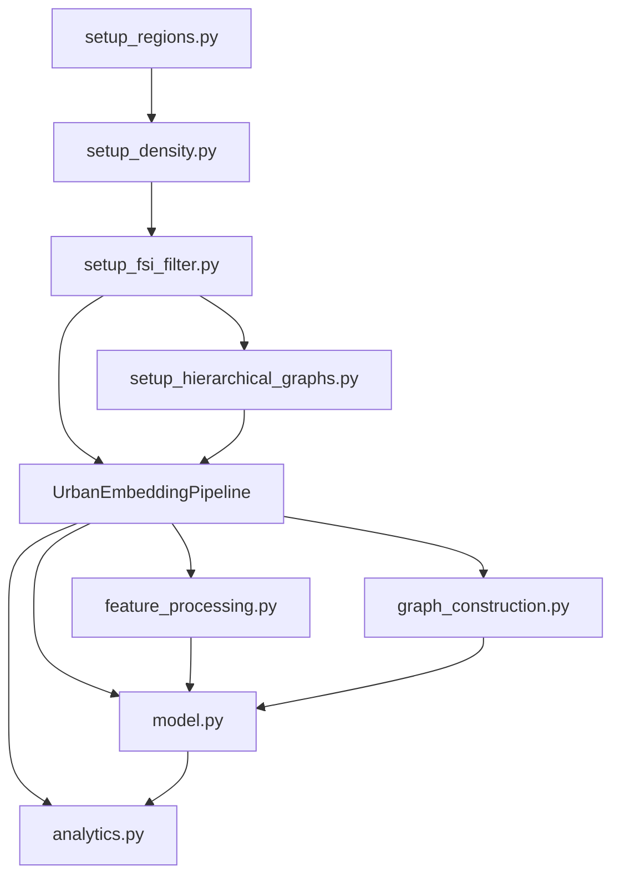

# UrbanRepML Architecture Documentation

## 🎯 Project Aim

UrbanRepML is a **multi-scale urban representation learning system** that creates meaningful embeddings of urban areas using Graph Neural Networks (GNNs). The system learns how different aspects of cities (transport, buildings, land use, accessibility) interact across multiple spatial scales to produce comprehensive urban representations.

### Core Objectives
1. **Learn urban representations** that capture the complexity of city structure
2. **Integrate multi-modal data** (transit, roads, buildings, POIs, aerial imagery)
3. **Model multi-scale interactions** using hierarchical H3 hexagons
4. **Enable urban analysis** through clustering and visualization

## 🏗️ System Architecture

### Overview
```
┌─────────────────────────────────────────────────────────────┐
│                     INPUT DATA SOURCES                       │
│  Embeddings: GTFS | Aerial | POI | Roads | Building Density │
└────────────────────────┬────────────────────────────────────┘
                         │
┌────────────────────────▼────────────────────────────────────┐
│                   DATA PREPARATION PIPELINE                  │
│  1. Region Setup → 2. Density Calc → 3. FSI Filter         │
└────────────────────────┬────────────────────────────────────┘
                         │
┌────────────────────────▼────────────────────────────────────┐
│                  GRAPH CONSTRUCTION                          │
│  Accessibility Networks: Walk (res10) | Bike (res9) | Drive (res8) │
└────────────────────────┬────────────────────────────────────┘
                         │
┌────────────────────────▼────────────────────────────────────┐
│                    URBANNET MODEL                            │
│  Multi-Resolution GNN with U-Net Architecture                │
└────────────────────────┬────────────────────────────────────┘
                         │
┌────────────────────────▼────────────────────────────────────┐
│                 OUTPUTS & ANALYSIS                           │
│  Embeddings | Clusters | Visualizations | Metrics           │
└─────────────────────────────────────────────────────────────┘
```

## 📊 Data Flow

### 1. Data Preparation Pipeline

#### Region Setup (`scripts/preprocessing/setup_regions.py`)
**Input:**
- City name (e.g., "south_holland")
- H3 resolutions to generate (default: 8,9,10)

**Process:**
- Geocodes city boundary using SRAI
- Creates H3 hexagonal tessellation at multiple resolutions
- Establishes parent-child relationships between resolutions

**Output:**
```
data/preprocessed/{city}_base/
├── boundaries/{city}_area.parquet       # Study area polygon
├── regions/{city}_res{8,9,10}.parquet   # H3 hexagons
└── total/{city}_res{8,9,10}_complete.parquet  # Combined data
```

#### Density Calculation (`scripts/preprocessing/setup_density.py`)
**Input:**
- Region data from setup_regions
- Building shapefile (e.g., PV28__00_Basis_Bouwblok.shp)

**Process:**
- Spatial intersection of buildings with H3 hexagons
- Calculates FSI (Floor Space Index) per hexagon
- Aggregates building volume and area

**Output:**
```
data/preprocessed/{city}_base/
├── density/{city}_res{8,9,10}_density.parquet  # FSI values
└── total/{city}_res{8,9,10}_complete.parquet   # Updated with density
```

#### FSI Filtering (`scripts/preprocessing/setup_fsi_filter.py`)
**Input:**
- Complete region+density data
- FSI threshold (absolute or percentile)

**Process:**
- Calculates threshold (e.g., 95th percentile of FSI values)
- Filters res-8 hexagons above threshold
- **Hierarchically includes ALL children** of selected parents

**Output:**
```
experiments/{experiment_name}/data/
├── boundaries/area_study_gdf.parquet
├── regions/regions_{8,9,10}_gdf.parquet
├── density/building_density_res{8,9,10}_preprocessed.parquet
├── mappings.pkl                         # Parent-child relationships
└── metadata.json                        # Filtering statistics
```

### 2. Graph Construction

#### Accessibility Graphs (`scripts/preprocessing/setup_hierarchical_graphs.py`)
**Input:**
- Filtered region data
- OSM street networks
- Travel parameters (speed, time limits)

**Process:**
- Downloads/loads OSM networks for area
- Calculates travel times between hexagon centroids
- Applies exponential decay: `accessibility = volume * exp(-β * time)`
- Filters edges by percentile threshold

**Output:**
```
experiments/{experiment_name}/graphs/
├── {city}_walk_res10_hierarchical.pkl   # Walking accessibility
├── {city}_bike_res9_hierarchical.pkl    # Cycling accessibility  
├── {city}_drive_res8_hierarchical.pkl   # Driving accessibility
└── hierarchical_mapping.pkl             # H3 hierarchy structure
```

### 3. Feature Processing

#### Multi-Modal Embeddings (`urban_embedding/feature_processing.py`)
**Input:**
- Pre-computed embeddings at H3 resolution 10:
  - `data/embeddings/gtfs/embeddings_GTFS_10.parquet`
  - `data/embeddings/aerial_alphaearth/embeddings_aerial_10_alphaearth.parquet`
  - `data/embeddings/poi_hex2vec/embeddings_POI_hex2vec_10.parquet`
  - `data/embeddings/road_network/embeddings_roadnetwork_10.parquet`

**Process:**
- Loads embeddings for active hexagons only
- Applies PCA dimensionality reduction per modality
- Maps features across resolutions using H3 hierarchy
- Fuses modalities with learned weights

**Output:**
- In-memory tensors for model training
- Cached PCA models in `cache/pca_models/`

### 4. Model Training

#### UrbanUNet Architecture (`urban_embedding/model.py`)
**Architecture:**
```
Resolution 10 (Walk) ──┐
                       ├─→ Encoder ──→ Bottleneck ──→ Decoder ──→ Embeddings
Resolution 9 (Bike)  ──┤      ↓              ↑           ↑
Resolution 8 (Drive) ──┘   Skip Connections ─┘───────────┘
```

**Components:**
- **Modality Fusion**: Weighted combination of input embeddings
- **GCN Encoders**: Graph convolutions with residual connections
- **Cross-Scale Mapping**: Learnable transformations between resolutions
- **GCN Decoders**: Reconstruction with skip connections
- **Loss Functions**: Reconstruction + Cross-scale consistency

**Training Process:**
- Batch size: 1 (full graph per batch)
- Optimizer: AdamW with weight decay
- Learning rate: 0.001 with cosine annealing
- Losses: Weighted combination of reconstruction and consistency

### 5. Analysis & Output

#### Analytics (`urban_embedding/analytics.py`)
**Processes:**
- K-means clustering of learned embeddings
- UMAP/t-SNE dimensionality reduction
- Spatial visualization on maps
- Cluster statistics and validation

**Outputs:**
```
experiments/{experiment_name}/results/
├── embeddings/
│   ├── embeddings_res{8,9,10}.parquet  # Learned representations
│   └── embeddings_combined.parquet     # Multi-scale fusion
├── clusters/
│   ├── clusters_res{8,9,10}.parquet    # Cluster assignments
│   └── cluster_statistics.json         # Metrics
├── visualizations/
│   ├── cluster_map_res{8,9,10}.png    # Spatial plots
│   └── embedding_space.png            # 2D projections
└── model_checkpoints/
    └── best_model.pt                   # Trained weights
```

## 🔄 Multi-Resolution Processing (Extended Architecture)

### Extended H3 Resolution Support (5-11)

The Cascadia GEO-INFER experiment extends the original 3-level system (8-10) to a comprehensive 7-level hierarchy (5-11), enabling analysis from regional patterns to ultra-fine features.

#### Resolution Specifications
| Res | Edge Length | Area per Hex | Hexagons (Cascadia) | Use Case |
|-----|-------------|--------------|---------------------|----------|
| 5   | 9.2 km      | 252.9 km²    | ~1,700             | Regional patterns |
| 6   | 3.2 km      | 31.0 km²     | ~13,600            | County-level analysis |
| 7   | 1.2 km      | 3.65 km²     | ~115,000           | Sub-county patterns |
| 8   | 0.46 km     | 0.46 km²     | ~915,000           | GEO-INFER standard |
| 9   | 0.17 km     | 0.054 km²    | ~7.8M              | Fine urban/agricultural |
| 10  | 0.066 km    | 0.0063 km²   | ~67M               | Detailed land use |
| 11  | 0.025 km    | 0.00074 km²  | ~570M              | Ultra-fine features |

#### Multi-Resolution Data Pipeline

```
┌─────────────────────────────────────────────────────────────────┐
│                    ALPHAEARTH SOURCE DATA                        │
│         2017-2024 | 64-dimensional embeddings | 10m resolution  │
└───────────────────────────┬─────────────────────────────────────┘
                            │
┌───────────────────────────▼─────────────────────────────────────┐
│              CASCADIA MULTI-RESOLUTION PROCESSOR                 │
│  Resolution 5 ◄─── Adaptive Sampling (10% pixels)               │
│  Resolution 6 ◄─── Adaptive Sampling (25% pixels)               │
│  Resolution 7 ◄─── Adaptive Sampling (50% pixels)               │
│  Resolution 8 ◄─── Full Processing (GEO-INFER primary)          │
│  Resolution 9 ◄─── Full Processing + Spatial Context            │
│  Resolution 10◄─── Full Processing + Neighbor Analysis          │
│  Resolution 11◄─── Full Processing + Memory Batching            │
└───────────────────────────┬─────────────────────────────────────┘
                            │
┌───────────────────────────▼─────────────────────────────────────┐
│                 HIERARCHICAL MAPPING                             │
│  Parent-Child Relationships | Cross-Scale Consistency           │
└───────────────────────────┬─────────────────────────────────────┘
                            │
┌───────────────────────────▼─────────────────────────────────────┐
│                  ACTUALIZATION PIPELINE                          │
│  Gap Detection | Relational Learning | Synthetic Generation     │
└─────────────────────────────────────────────────────────────────┘
```

#### Memory Optimization Strategies

**Adaptive Sampling by Resolution:**
- **Resolutions 5-7**: Sample 10-50% of pixels for aggregation
- **Resolution 8**: Full processing (GEO-INFER compatibility)
- **Resolutions 9-11**: Full processing with memory batching

**Batch Processing:**
```python
# Resolution-specific batch sizes
batch_sizes = {
    5: 100000,    # Regional - large batches
    6: 50000,     # County - medium batches  
    7: 20000,     # Sub-county - smaller batches
    8: 10000,     # Standard - balanced
    9: 5000,      # Fine - careful memory
    10: 2000,     # Detailed - small batches
    11: 1000      # Ultra-fine - tiny batches
}
```

#### Cross-Scale Analysis Capabilities

**Hierarchical Consistency:**
- Parent cells aggregate child cell features
- Cross-scale validation ensures data integrity
- Multi-resolution training enables pattern learning

**Scale-Specific Applications:**
- **Res 5-6**: Regional development patterns, watershed analysis
- **Res 7-8**: Municipal planning, zoning analysis  
- **Res 9-10**: Precision agriculture, urban design
- **Res 11**: Individual building analysis, micro-climates

### Actualization Framework for Synthetic Data

#### Theoretical Foundation
Actualization implements the philosophical concept of "carving nature at its joints" - identifying the inherent relational structure in spatial data to generate synthetic embeddings for gaps.

#### Pipeline Components

```
┌─────────────────────────────────────────────────────────────────┐
│                     GAP DETECTION                                │
│  Spatial Gaps | Temporal Gaps | Quality Gaps | Coverage Analysis│
└───────────────────────────┬─────────────────────────────────────┘
                            │
┌───────────────────────────▼─────────────────────────────────────┐
│                  RELATIONAL LEARNING                             │
│  VAE/GAN Training | Spatial Context | Temporal Consistency      │
└───────────────────────────┬─────────────────────────────────────┘
                            │
┌───────────────────────────▼─────────────────────────────────────┐
│                 SYNTHETIC GENERATION                             │
│  Missing Regions | Temporal Interpolation | Quality Enhancement │
└───────────────────────────┬─────────────────────────────────────┘
                            │
┌───────────────────────────▼─────────────────────────────────────┐
│                     VALIDATION                                   │
│  Spatial Coherence | Temporal Consistency | Distribution Match  │
└─────────────────────────────────────────────────────────────────┘
```

#### Gap Detection Methods

**Spatial Coverage Analysis:**
- Expected vs. actual hexagon coverage per resolution
- Contiguous gap cluster identification
- Border region completeness validation

**Temporal Consistency Tracking:**
- Year-to-year coverage comparison
- Missing data pattern analysis
- Seasonal availability assessment

**Quality Assessment:**
- Embedding variance analysis (detect low-information regions)
- Outlier detection (identify corrupted data)
- Signal-to-noise ratio evaluation

#### Synthetic Data Generation

**VAE-Based Actualization:**
```python
class VAEActualizer(nn.Module):
    """Learns latent representations for gap inference"""
    - Encoder: Observed data → Latent space
    - Decoder: Latent space → Synthetic embeddings
    - Spatial context integration
    - Temporal consistency constraints
```

**Relational Context Integration:**
- Neighbor embeddings (1-ring and 2-ring)
- Parent-child relationships across resolutions  
- Temporal sequence learning for missing years

### GEO-INFER Integration Architecture

#### Data Structure Alignment

```
┌─────────────────────────────────────────────────────────────────┐
│              URBANREPML H3 MULTI-RESOLUTION DATA                 │
│  Resolutions 5-11 | AlphaEarth Embeddings | Synthetic Filling   │
└───────────────────────────┬─────────────────────────────────────┘
                            │
┌───────────────────────────▼─────────────────────────────────────┐
│                 GEO-INFER FORMATTER                               │
│  Resolution 8 Primary | County Assignment | Agricultural Flags  │
└───────────────────────────┬─────────────────────────────────────┘
                            │
┌───────────────────────────▼─────────────────────────────────────┐
│                GEO-INFER COMPATIBLE OUTPUT                        │
│  Schema: county_fips | state_fips | h3_index | embeddings       │
│  Metadata: agricultural_likelihood | synthetic_flag | quality   │
└─────────────────────────────────────────────────────────────────┘
```

#### Cross-Border Analysis Support

**Seamless Integration:**
- California (16 counties) + Oregon (36 counties) = 52 counties
- Consistent H3 tessellation across state boundaries
- Agricultural pattern continuity validation

**Policy Integration Points:**
- County-level aggregations for administrative analysis
- State-level comparisons for policy development
- Regional patterns for bioregional management

## 🎛️ Key Parameters (Dials to Turn)

### Data Selection
| Parameter | Description | Default | Impact |
|-----------|-------------|---------|--------|
| `fsi_percentile` | Building density percentile threshold | 95 | Higher = fewer, denser areas |
| `fsi_threshold` | Absolute FSI threshold | 0.1 | Higher = only very dense areas |
| `resolutions` | H3 levels to process | [8,9,10] | Trade-off detail vs. computation |

### Graph Construction
| Parameter | Description | Default | Impact |
|-----------|-------------|---------|--------|
| `cutoff_time` | Max travel time (seconds) | 300 | Larger = more connections |
| `percentile_threshold` | Edge filtering percentile | 90 | Higher = sparser graphs |
| `speeds` | Travel speeds (m/s) | walk:1.4, bike:4.17, drive:11.11 | Affects reachability |
| `beta` | Distance decay parameter | walk:0.002, bike:0.0012, drive:0.0008 | Higher = faster decay |

### Model Architecture
| Parameter | Description | Default | Impact |
|-----------|-------------|---------|--------|
| `hidden_dim` | GNN hidden dimension | 128 | Higher = more capacity |
| `num_convs` | GCN layers per block | 4 | Deeper = larger receptive field |
| `dropout` | Dropout rate | 0.1 | Higher = more regularization |

### Training
| Parameter | Description | Default | Impact |
|-----------|-------------|---------|--------|
| `epochs` | Training iterations | 100 | More = better fit (maybe overfit) |
| `learning_rate` | Optimization step size | 0.001 | Higher = faster but unstable |
| `weight_decay` | L2 regularization | 0.0001 | Higher = simpler model |
| `loss_weights` | {reconstruction: 1, consistency: 3} | - | Balance local vs. cross-scale |

### Feature Processing
| Parameter | Description | Default | Impact |
|-----------|-------------|---------|--------|
| `variance_threshold` | PCA variance retained | 0.95 | Higher = more dimensions |
| `min_components` | Min PCA dimensions per modality | {aerial:50, poi:20, gtfs:10, road:10} | Modality importance |
| `max_components` | Max PCA dimensions | 100 | Computational limit |

## 📦 Module Dependencies



## 🔧 Script Interfaces

### Preprocessing Scripts
All preprocessing scripts follow a consistent interface:

```bash
python scripts/preprocessing/SCRIPT.py \
  --city_name CITY \
  --input_dir INPUT \
  --output_dir OUTPUT \
  --additional_params...
```

Output is always structured as:
- Parquet files for data
- JSON for metadata
- Pickle for complex objects (graphs, mappings)

### Experiment Orchestration
The `run_experiment.py` script chains everything:

```bash
python scripts/experiments/run_experiment.py \
  --experiment_name NAME \
  --city CITY \
  --fsi_percentile 95 \
  --run_training \
  --epochs 100
```

## 🚀 Performance Considerations

### Computational Complexity
- **Region Setup**: O(n) where n = number of hexagons
- **Density Calculation**: O(n*m) spatial intersection
- **Graph Construction**: O(n²) pairwise distances (with cutoff)
- **Model Training**: O(E*N*D²) where E=epochs, N=nodes, D=dim

### Memory Requirements
- **Small city** (10k hexagons): ~4GB RAM
- **Medium city** (100k hexagons): ~16GB RAM  
- **Large region** (250k hexagons): ~32GB RAM

### Optimization Strategies
1. **Hierarchical Filtering**: Process only urban areas
2. **Graph Sparsification**: Keep top percentile of edges
3. **PCA Reduction**: Reduce embedding dimensions
4. **Caching**: Reuse computed graphs and networks
5. **GPU Acceleration**: Use CUDA for model training

## 📈 Validation & Metrics

### Internal Validation
- **Reconstruction Loss**: How well model rebuilds input features
- **Consistency Loss**: Cross-scale embedding alignment
- **Cluster Metrics**: Silhouette score, Davies-Bouldin index

### External Validation
- **Urban Typologies**: Compare with known city classifications
- **Socio-Economic**: Correlate with census/economic data
- **Transport**: Validate against actual travel patterns

## 🔍 Debugging & Monitoring

### Logging
- All scripts use Python logging
- Logs saved to `urban_embedding.log`
- Verbosity controlled by `--debug` flag

### Experiment Tracking
- WandB integration for training metrics
- Local JSON metadata for reproducibility
- Checkpoint saving for model recovery

### Common Issues
1. **OOM on graphs**: Reduce `cutoff_time` or increase `percentile_threshold`
2. **No FSI data**: Check building shapefile projection matches regions
3. **Empty graphs**: Lower FSI threshold or check OSM network coverage
4. **Poor clusters**: Adjust loss weights or increase training epochs