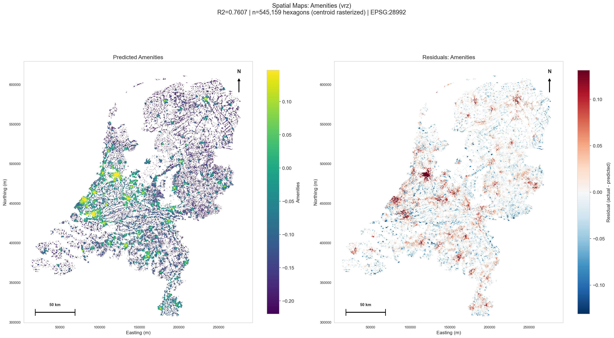
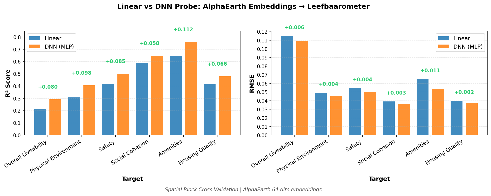
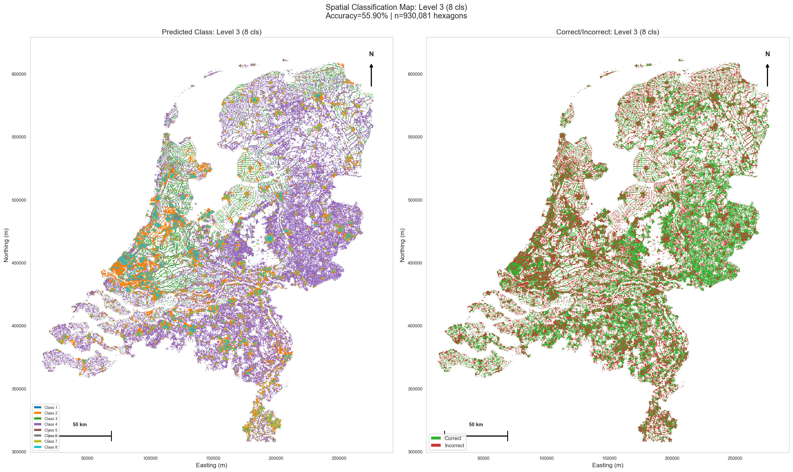
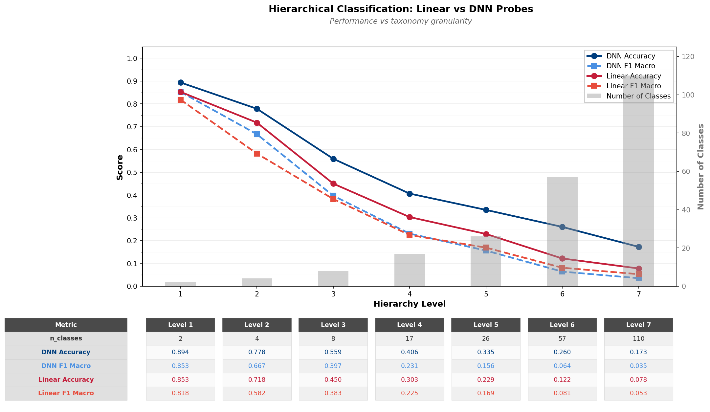

# UrbanRepML

**Dense urban embeddings from independent modalities, fused on hexagonal grids, probed for what they learned.**

[](https://www.python.org/downloads/)
[](https://opensource.org/licenses/MIT)
[](https://github.com/kraina-ai/srai)

UrbanRepML learns dense geospatial (urban) representations by encoding each data modality independently, fusing them spatially through multi-resolution U-Net architectures on [H3 hexagonal grids](https://h3geo.org/), then probing the resulting embeddings against external ground truth. All spatial operations use [SRAI](https://github.com/kraina-ai/srai). The project is developed by a human and [12 specialist AI agents](#multi-agent-development) coordinated through stigmergic scratchpads.

For background on the approach and early results, see the [Active Inference Institute talk](https://www.youtube.com/watch?v=UYD8CR_Xorg&ab_channel=ActiveInferenceInstitute).

---

## Preliminary Results

The Netherlands study area covers ~545K H3 resolution-9 hexagons with 64-dimensional AlphaEarth embeddings (pre-computed Google Earth Engine features). All probes use spatial block cross-validation to prevent geographic leakage.

### Livability Regression: Linear vs DNN Probes

Probing embeddings against [Leefbaarometer](https://www.leefbaarometer.nl/) livability indicators reveals that nonlinearity matters. For the Amenities target, the linear probe achieves R²=0.65 while the DNN probe reaches R²=0.76 -- the MLP captures spatial patterns that ridge regression cannot.

| Linear Probe -- Amenities (R²=0.65) | DNN Probe -- Amenities (R²=0.76) |
|:---:|:---:|
|  |  |

Across all 6 Leefbaarometer targets, the DNN consistently outperforms linear probes:



### Building Morphology Classification

The same embeddings can predict hierarchical [Urban Taxonomy](https://urbantaxonomy.org/) classes (building morphology). A 7-level hierarchy ranges from 2 classes at the coarsest level to 106+ at the finest. DNN probes consistently outperform logistic regression, and accuracy degrades gracefully as the number of classes grows exponentially.

| DNN Probe — Level-3 Spatial Map (8 classes, 56% accuracy) | Hierarchical Accuracy Comparison |
|:---:|:---:|
|  |  |

---

## Three-Stage Pipeline

### Stage 1: Modality Encoders

Each modality is processed independently into H3-indexed embeddings:

| Modality | Source | Status |
|----------|--------|--------|
| **AlphaEarth** | Google Earth Engine pre-computed embeddings | Working (64-dim) |
| **Aerial Imagery** | PDOK Netherlands orthophotos via DINOv3 | Partial |
| **POI** | OpenStreetMap points, categorical density | Partial |
| **Roads** | OSM network topology, connectivity metrics | Partial |
| **GTFS** | Transit stops, accessibility potential | Planned |

### Stage 2: Fusion

Two multi-resolution U-Net architectures fuse modality embeddings using H3 hierarchy and accessibility graphs:

- **FullAreaUNet** -- processes entire study area with lateral accessibility graph. Multi-resolution encoder-decoder (res 8-10) with skip connections.
- **ConeBatchingUNet** -- hierarchical cones (res 5 to 10), each ~1,500 hexagons. Memory-efficient and parallelizable. Most promising direction.

### Stage 3: Analysis

Post-training probing and visualization:

- **Regression probes** -- Linear (Ridge/Lasso) and DNN (MLP) against Leefbaarometer livability scores with spatial block CV
- **Classification probes** -- Logistic regression and DNN against hierarchical [Urban Taxonomy](https://urbantaxonomy.org/) (building morphology)
- **Clustering** -- Hierarchical multi-scale clustering across H3 resolutions with landscape visualization

---

## Multi-Agent Development

UrbanRepML is developed by a human working with 12 specialist AI agents coordinated through [Claude Code](https://docs.anthropic.com/en/docs/agents-and-tools/claude-code/overview). The agents communicate across sessions via scratchpad files -- a form of [stigmergy](https://en.wikipedia.org/wiki/Stigmergy) where agents leave traces in the environment rather than messaging each other directly.

**The agents:**

| Role | What it does |
|------|-------------|
| Coordinator | OODA loop: observe scratchpads, orient, decide priorities, delegate |
| SRAI-Spatial | Spatial operations, H3 tessellation, SRAI compliance |
| Stage 1 Encoder | Modality processing pipelines |
| Stage 2 Architect | Fusion model design and training |
| Stage 3 Analyst | Probes, clustering, visualization |
| Spec Writer | Architecture specs and design tradeoffs |
| Execution | One-off scripts, data wrangling, ad hoc tasks |
| DevOps | Git, CI, packaging, file operations |
| QAQC | Code review, test coverage, commit-readiness verdicts |
| Librarian | Maintains codebase graph, tracks module interfaces |
| Ego | Process health assessments, flags coordination failures |
| Plan | Session planning, wave structure, dependency ordering |

The coordination infrastructure includes session-start hooks that auto-inject context, path-scoped rules that surface relevant conventions when touching specific code, and scratchpad enforcement gates that block agents from completing without logging their work. See `specs/claude_code_multi_agent_setup.md` for the full architecture.

---

## Setup

```bash
git clone https://github.com/bertberkers/UrbanRepML.git
cd UrbanRepML
uv sync              # Install all dependencies
uv sync --extra dev  # Include dev tools
```

Requires Python 3.10+. Uses [uv](https://github.com/astral-sh/uv) for dependency management.

## Project Structure

```
UrbanRepML/
├── stage1_modalities/   # Modality encoders (AlphaEarth, POI, Roads, Aerial)
├── stage2_fusion/       # Fusion models, data loading, graph construction
├── stage3_analysis/     # Probes, clustering, visualization
├── scripts/             # Processing and training scripts
├── utils/               # StudyAreaPaths, SpatialDB, shared utilities
├── specs/               # Architecture decision documents
├── tests/               # Import smoke tests, H3 compliance
├── .claude/             # Multi-agent infrastructure (hooks, rules, skills, scratchpads)
├── data/                # Study-area organized data (not in repo)
└── docs/                # Images and documentation for GitHub
```

Study areas are self-contained under `data/study_areas/{name}/` with standardized subdirectories for boundaries, tessellations, embeddings, cones, fused results, analysis outputs, and plots.

## License

MIT License -- see [LICENSE](LICENSE)

## Acknowledgments

- [SRAI](https://github.com/kraina-ai/srai) -- Spatial Representations for AI
- [H3](https://h3geo.org/) -- Hexagonal hierarchical geospatial indexing (via SRAI)
- [PyTorch Geometric](https://pytorch-geometric.readthedocs.io/) -- Graph neural networks
- [Leefbaarometer](https://www.leefbaarometer.nl/) -- Dutch livability scoring (regression probe target)
- [Urban Taxonomy](https://urbantaxonomy.org/) -- Hierarchical building morphology (classification probe target)
- [Apache Sedona](https://sedona.apache.org/) -- Spatial query engine (via SpatialDB wrapper)
- [Claude Code](https://docs.anthropic.com/en/docs/agents-and-tools/claude-code/overview) -- Multi-agent development environment
