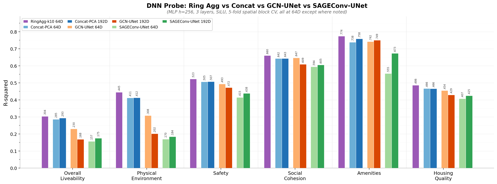

# Spatial Fusion Probe Comparison (2026-03-14)

## Setup

- **Target**: Leefbaarometer (6 dimensions), res9, year 20mix, 130K hexagons
- **Probe**: MLP (h=256, 3 layers, SiLU), 5-fold spatial block CV (10km), max 200 epochs, patience 20
- **Input**: 208D concat (AE 64 + hex2vec 50 + Roads 30 + GTFS 64)

Seven conditions tested, spanning no spatial context → simple averaging → learned graph convolution:

| Condition | Spatial context | Dims | Training |
|-----------|----------------|------|----------|
| Concat-PCA-64D | None | 64 | PCA only |
| Concat-PCA-192D | None | 192 | PCA only |
| RingAgg-k10-PCA-64D | 10-hop exponential average, res9 | 64 | Zero parameters |
| GCN-UNet-64D | 4 GCNConv/block, res 9/8/7 | 64 | Converged ep334, loss 0.0028 |
| GCN-UNet-192D | Same, multiscale concat | 192 | Same checkpoint |
| SAGEConv-UNet-64D | 10 SAGEConv/block, res 9/8/7 | 64 | Converged ep668, loss 0.0012 |
| SAGEConv-UNet-192D | Same, multiscale concat | 192 | Same checkpoint |

## Results

| Target | RingAgg-k10 | Concat-64D | Concat-192D | GCN-64D | GCN-192D | SAGE-64D | SAGE-192D |
|--------|-------------|------------|-------------|---------|----------|----------|-----------|
| lbm (Overall Liveability) | **0.304** | 0.286 | 0.293 | 0.231 | 0.169 | 0.157 | 0.175 |
| fys (Physical Environment) | **0.445** | 0.412 | 0.413 | 0.308 | 0.202 | 0.170 | 0.184 |
| onv (Safety) | **0.523** | 0.506 | 0.508 | 0.493 | 0.472 | 0.415 | 0.438 |
| soc (Social Cohesion) | **0.660** | 0.643 | 0.643 | 0.647 | 0.610 | 0.594 | 0.605 |
| vrz (Amenities) | **0.774** | 0.738 | 0.759 | 0.742 | 0.750 | 0.555 | 0.673 |
| won (Housing Quality) | **0.486** | 0.467 | 0.466 | 0.455 | 0.429 | 0.407 | 0.425 |
| **mean** | **0.532** | 0.509 | 0.514 | 0.479 | 0.439 | 0.383 | 0.417 |

## Findings

1. **Ring aggregation wins all 6 targets.** A zero-parameter 10-hop average (mean R²=0.532) beats every learned model. Spatial context is valuable — the UNet just fails to preserve it.

2. **Spatial context IS valuable for leefbaarometer.** RingAgg improves over raw concat by +0.024 mean R² (+4.7%). The strongest gains are on vrz (amenities, +0.036) and fys (physical environment, +0.032) — both inherently spatial dimensions.

3. **The reconstruction objective destroys task-relevant signal.** Both UNet variants perform worse than raw concat. SAGEConv convergence actually *hurts* probe quality (ep17: 0.420 → ep668: 0.383). The model learns to reconstruct faithfully but loses discriminative features.

4. **More GNN depth = more oversmoothing.** SAGEConv-10 (0.383) < GCNConv-4 (0.479). Deeper message passing washes out local signal that the probe needs.

5. **Multiscale concatenation (192D) doesn't help UNets.** Adding coarser resolution embeddings adds noise from zero-filled hexagons without res7 ancestors. Only raw concat benefits marginally from 192D (0.514 vs 0.509).

## Implications

The UNet bottleneck (208D → 64D) combined with reconstruction loss destroys information that a simple spatial average preserves. Ring aggregation keeps the full feature signal and adds spatial context through weighted neighborhood averaging.

Next directions:
- Feed ring-aggregated features into a downstream model (ring agg as preprocessing, not as the model)
- Explore contrastive or predictive objectives instead of reconstruction
- Consider whether the UNet architecture is even needed, or if ring aggregation + PCA is sufficient

## Data

- [Ring agg results](../data/study_areas/netherlands/stage3_analysis/dnn_probe/2026-03-14_ring_agg_k10_comparison/probe_ring_agg_comparison.csv)
- [UNet comparison](../data/study_areas/netherlands/stage3_analysis/dnn_probe/2026-03-14_sageconv_comparison/probe_sageconv_comparison.csv)
- [PCA comparison (Wave 1)](../data/study_areas/netherlands/stage3_analysis/dnn_probe/2026-03-14_fair_pca_comparison/probe_fair_pca_regression.csv)

## Session changes

- GTFS autoencoder now trains only on transit hexagons (was 97.2% background noise)
- GTFS added to SPARSE_MODALITIES (zero-fill instead of inner join)
- UNet: consistency loss 1.0→0.3, stripped intermediate L2 norms, CosineAnnealingWarmRestarts LR scheduler
- Checkpoint versioning: `best_model_{year}_{dim}D_{date}.pt`
- Tested GCNConv (4 layers) and SAGEConv (10 layers) — both underperform raw concat
