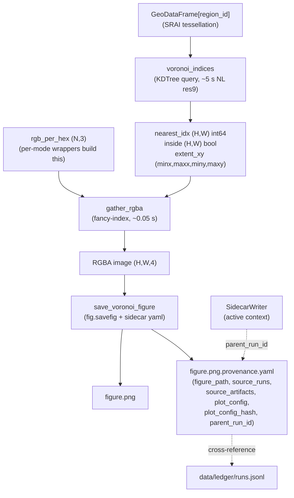
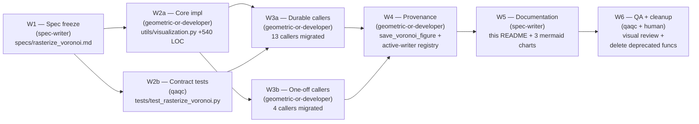
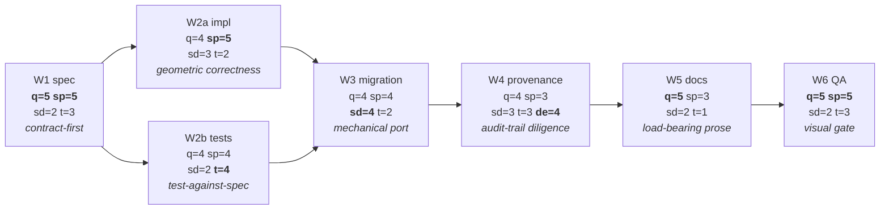

# Visualization Toolkit

Durable visualization infrastructure for UrbanRepML stage-3 figures: KDTree-Voronoi
rasterization of H3-indexed embeddings, with provenance-aware figure saving.

The implementations live in [`utils/visualization.py`](../../utils/visualization.py).
This `scripts/visualization/` directory hosts the audit + (eventually) other durable
visualization scripts.

**Frozen contract**: [`specs/rasterize_voronoi.md`](../../specs/rasterize_voronoi.md).
**Plan**: [`.claude/plans/2026-05-02-rasterize-voronoi-toolkit.md`](../../.claude/plans/2026-05-02-rasterize-voronoi-toolkit.md).

---

## 1. Telos — why Voronoi is the standard

Centroid-splat with a `stamp` radius (degrees, fudge factor) was a serviceable
approximation but carried three structural bugs at NL scale: directional south-east
bleed from asymmetric splat offsets, density-dependent speckle holes from
hexagonal-vs-rectangular packing, and lat-lon aspect distortion (1° lon ≠ 1° lat at
52° N). The KDTree-Voronoi approach replaces all three: query the nearest hex centroid
per pixel in a metric CRS, paint the cell's value if within `max_dist_m` of the
centroid, leave transparent otherwise. The output is a geometrically truthful Voronoi
tessellation, clipped to a sane geographic neighbourhood, with crisper silhouettes.

The decisive operational win is **gallery reuse**: the KDTree query is the dominant
cost (~5 s for NL res9 at 250 m/px), so a single `voronoi_indices` call amortises
across N panels via N cheap `gather_rgba` fancy-index gathers. An 8-panel ring-agg
gallery renders in ~5 s + 8×(~0.05 s) instead of 8×(~3 s).

The toolkit replaces the centroid-splat helpers (`rasterize_continuous`, `rasterize_rgb`,
`rasterize_binary`, `rasterize_categorical`) — these are deprecated and will be deleted
in W6 of the rasterize-voronoi-toolkit plan. The deprecated `stamp` parameter (degrees)
is replaced by `max_dist_m` (metres) with geometric meaning.

---

## 2. Quick start

### One-shot — single panel

```python
import matplotlib.pyplot as plt
from utils.visualization import rasterize_continuous_voronoi, load_boundary, plot_spatial_map
from utils.spatial_db import SpatialDB
from utils.paths import StudyAreaPaths

paths = StudyAreaPaths("netherlands")
db = SpatialDB.for_study_area("netherlands")
hex_ids = emb_df.index.to_numpy()
cx_m, cy_m = db.centroids(list(hex_ids), resolution=9, crs=28992)

extent_m = (cx_m.min() - 2_000, cy_m.min() - 2_000,
            cx_m.max() + 2_000, cy_m.max() + 2_000)

image, extent_xy = rasterize_continuous_voronoi(
    cx_m, cy_m, emb_df["score"].to_numpy(), extent_m,
    cmap="viridis", pixel_m=250.0, max_dist_m=300.0,
)

fig, ax = plt.subplots(figsize=(10, 12))
ax.imshow(image, extent=extent_xy, origin="lower",
          interpolation="nearest", aspect="equal")
ax.set_aspect("equal")
```

### Gallery via index reuse — N panels share one Voronoi query

```python
from utils.visualization import voronoi_indices, gather_rgba

# 1. Build the Voronoi index ONCE (~5 s for NL res9).
nearest_idx, inside, extent_xy = voronoi_indices(
    cx_m, cy_m, extent_m, pixel_m=250.0, max_dist_m=300.0,
)

# 2. Gather N panels via fancy-index (~0.05 s each).
panels = [gather_rgba(nearest_idx, inside, rgb)
          for rgb in (cluster_rgb_tab10, pc_rgb, turbo_rgb, cividis_rgb,
                      hsv_rgb, set1_rgb, dark2_rgb, paired_rgb)]

# 3. imshow each panel with the shared extent.
fig, axes = plt.subplots(2, 4, figsize=(20, 12))
for ax, img in zip(axes.flat, panels):
    ax.imshow(img, extent=extent_xy, origin="lower",
              interpolation="nearest", aspect="equal")
```

### With provenance — emit `*.provenance.yaml` sibling

```python
from utils.visualization import save_voronoi_figure

fig, ax = plt.subplots(figsize=(10, 12))
image, extent_xy = rasterize_continuous_voronoi(cx_m, cy_m, values, extent_m)
ax.imshow(image, extent=extent_xy, origin="lower", interpolation="nearest")

save_voronoi_figure(
    fig,
    "data/study_areas/netherlands/stage3_analysis/embeddings/2026-05-02/concat_voronoi.png",
    source_runs=["abc123def456"],                        # upstream sidecar run_id(s)
    source_artifacts=["data/.../concat_res9_20mix.parquet"],
    plot_config={"pixel_m": 250.0, "max_dist_m": 300.0,
                 "cmap": "viridis", "mode": "continuous"},
)
# Emits concat_voronoi.png + concat_voronoi.png.provenance.yaml.
# parent_run_id auto-populates if save_voronoi_figure runs inside an
# active utils.provenance.SidecarWriter context.
```

---

## 3. API reference

All functions live in [`utils/visualization.py`](../../utils/visualization.py).
For full contract details see
[`specs/rasterize_voronoi.md`](../../specs/rasterize_voronoi.md).

### Core — Voronoi primitives

| Function | Semantics |
|---|---|
| `voronoi_indices(cx_m, cy_m, extent_m, *, pixel_m=250.0, max_dist_m=300.0)` | Build per-pixel `(nearest_idx, inside, extent_xy)` once. The gallery primitive. ([spec §Core](../../specs/rasterize_voronoi.md#core-voronoi_indices)) |
| `gather_rgba(nearest_idx, inside, rgb_per_hex)` | Fancy-index gather: project a per-hex `(N, 3)` colour table onto the precomputed grid. Returns `(H, W, 4)` float32 RGBA. ([spec §Core](../../specs/rasterize_voronoi.md#core-gather_rgba)) |
| `rasterize_voronoi(cx_m, cy_m, rgb_per_hex, extent_m, *, pixel_m=250.0, max_dist_m=300.0)` | One-shot wrapper for single-panel callers. Returns `(image, extent_xy)`. ([spec §Core](../../specs/rasterize_voronoi.md#core-rasterize_voronoi)) |

### Per-mode wrappers — colormap-aware Voronoi rasters

| Function | Mode |
|---|---|
| `rasterize_continuous_voronoi(cx_m, cy_m, values, extent_m, *, cmap, vmin, vmax, pixel_m, max_dist_m, bg_color)` | Continuous scalars → colormap → RGBA. `vmin`/`vmax` default to 2nd/98th percentile. ([spec §Per-mode wrappers](../../specs/rasterize_voronoi.md#per-mode-wrappers-replace-the-four-current-rasterize_-functions)) |
| `rasterize_categorical_voronoi(cx_m, cy_m, labels, extent_m, *, n_clusters, cmap, color_map, fallback_color, pixel_m, max_dist_m, bg_color)` | Integer or string labels → categorical RGBA. `color_map` overrides `cmap`. |
| `rasterize_binary_voronoi(cx_m, cy_m, extent_m, *, color, pixel_m, max_dist_m)` | Presence-only Voronoi raster painted in `color`. |
| `rasterize_rgb_voronoi(cx_m, cy_m, rgb_array, extent_m, *, pixel_m, max_dist_m)` | Identity wrapper around `rasterize_voronoi` for `(N, 3)` RGB inputs. |

GeoDataFrame overloads (preferred at API boundaries — they carry CRS metadata):
- `rasterize_continuous_voronoi_gdf(gdf, value_col, ...)`
- `rasterize_categorical_voronoi_gdf(gdf, label_col, ...)`
- `rasterize_binary_voronoi_gdf(gdf, ...)`
- `rasterize_rgb_voronoi_gdf(gdf, rgb_array, ...)`

GDFs must be indexed by `region_id` (SRAI convention; `h3_index` triggers a soft warning).

### Adapters

| Function | Semantics |
|---|---|
| `latlon_to_metric(lats, lons, target_crs=28992)` | Reproject EPSG:4326 arrays to a metric CRS (default RD New for NL). Required for callers whose centroid arrays are in lat/lon. ([spec §Adapter](../../specs/rasterize_voronoi.md#adapter-latlon_to_metric)) |
| `voronoi_params_for_resolution(resolution)` | Resolution-keyed `(pixel_m, max_dist_m)` defaults: res7→1500/2000, res8→600/800, res9→250/300, res10→100/120, res11→40/50. Used by W3-migrated callers. |

### Peer — label-grid output

| Function | Semantics |
|---|---|
| `rasterize_labels(cx_m, cy_m, labels, extent_m, *, pixel_m, max_dist_m, fill_value=-1)` | Returns `(H, W)` int64 label grid for edge detection / boundary visualisation. **NOT a Voronoi RGBA — different output type.** Lifted from `plot_targets.py:rasterize_labels_to_grid` (W3 case 2). ([spec §Peer function](../../specs/rasterize_voronoi.md#peer-function-rasterize_labels)) |

### Provenance

| Function | Semantics |
|---|---|
| `save_voronoi_figure(fig, path, *, source_runs, source_artifacts, plot_config, provenance=True, dpi=300, bbox_inches="tight", facecolor=None, producer_script=None)` | `fig.savefig` + emit `{path}.provenance.yaml` sibling per [`specs/artifact_provenance.md`](../../specs/artifact_provenance.md) §"Figure-provenance specialisation". `parent_run_id` auto-populates from any active `utils.provenance.SidecarWriter` (contextvar registry). Provenance failures are best-effort: logged to stderr, never block the figure save. Set `provenance=False` for ad-hoc exploratory plotting. |

### Plot helpers (preserved from pre-Voronoi API)

| Function | Semantics |
|---|---|
| `plot_spatial_map(ax, image, extent, boundary_gdf, title="", *, show_rd_grid=True, title_fontsize=11, disable_rd_grid=False)` | Render rasterized image on axes with boundary underlay + 50-km RD grid. `disable_rd_grid` absorbs the `plot_targets.py` shadow (W3 case 3). |
| `_add_colorbar(ax, mappable, ..., label_fontsize=10, tick_fontsize=8)` | Standard colorbar with project styling. (Private but used cross-script.) |
| `load_boundary(paths, crs=28992)` | Load study area boundary, filter to largest part (drops Caribbean for NL), reproject. |
| `filter_empty_hexagons(emb_df, display_name, constant_threshold=0.10)` | Three-pass background-vector filter for sparse modalities. |
| `detect_embedding_columns(df)` | Infer embedding columns by name (`A00`, `emb_0`, `gtfs2vec_0`, ...). |

---

## 4. Data flow



The dotted arrows indicate optional auto-population: `save_voronoi_figure` reads the
active `SidecarWriter` (if any) via `utils.provenance.get_active_sidecar()` and
populates `parent_run_id` automatically — no manual threading at call sites.

---

## 5. Wave structure (this plan)



W2a ‖ W2b run in parallel against the frozen spec. W3a ‖ W3b run in parallel after
both W2 sub-waves land. W4 wires provenance once all callers use the new API. W5 (this
README) lands after W4 so it can document the full surface including
`save_voronoi_figure`. W6 is the final gate: human visual review + deletion of the
deprecated centroid-splat functions.

---

## 6. Characteristic-states gradient across waves

The teleological chart. Each wave's disposition (`q`=quality, `sp`=spatial,
`sd`=speed, `t`=tests, `de`=data_eng) is pulled verbatim from the plan's wave
headers. Future contributors read this to see how the plan's character changes
phase by phase — slow + rigorous at the contract end, fast + mechanical in the
middle, slow + visual at the closing gate.



Bold dimensions are the wave's load-bearing axes. Reading left-to-right: quality and
spatial-rigour bookend the plan (W1 contract, W6 visual gate); speed peaks in the
middle (W3 mechanical migration); data-engineering peaks in W4 (the provenance wave);
tests peak in W2b (where the spec gets its acceptance set written). The gradient is
the bridge from `/valuate`'s static state to `/niche`'s dynamic execution — each
wave's agent reads its disposition before starting work to know **how** to work.

---

## 7. Migration notes

### Deprecation table

| Deprecated (W2 docstring tag, W6 deleted) | Replacement (W2 added) | Conversion |
|---|---|---|
| `rasterize_continuous(cx, cy, values, extent, *, stamp=...)` | `rasterize_continuous_voronoi(cx_m, cy_m, values, extent_m, *, max_dist_m=...)` | `max_dist_m ≈ stamp_deg * 111000` at NL latitudes; **prefer** `voronoi_params_for_resolution(resolution)`. |
| `rasterize_rgb(cx, cy, rgb_array, extent, *, stamp=...)` | `rasterize_rgb_voronoi(cx_m, cy_m, rgb_array, extent_m, *, max_dist_m=...)` | Same. |
| `rasterize_binary(cx, cy, extent, *, color=..., stamp=...)` | `rasterize_binary_voronoi(cx_m, cy_m, extent_m, *, color=..., max_dist_m=...)` | Same. |
| `rasterize_categorical(cx, cy, labels, extent, n_clusters, *, cmap=..., stamp=...)` | `rasterize_categorical_voronoi(cx_m, cy_m, labels, extent_m, *, n_clusters=..., cmap=..., color_map=...)` | `n_clusters` becomes keyword-only; `color_map` (dict override) is new. |
| `RASTER_W = 2000`, `RASTER_H = 2400` (module constants) | (deleted in W6; derive from `extent_m` and `pixel_m`) | No replacement; centroid-splat-specific. |
| `_stamp_pixels` (private) | (deleted in W6) | Centroid-splat helper, not needed. |
| `scripts/stage3/plot_targets.py:66-204` shadows | Use `utils/visualization.py` versions with new optional kwargs (`bg_color`, `disable_rd_grid`, fontsize) | W3a special case — already migrated. |
| `scripts/stage3/plot_targets.py:rasterize_labels_to_grid` | `utils/visualization.py:rasterize_labels` | Peer function, not Voronoi-API. |

### Caller workflow

1. Replace `rasterize_*(stamp=N)` with `rasterize_*_voronoi(pixel_m=..., max_dist_m=...)`.
2. **Prefer** `voronoi_params_for_resolution(resolution)` over manual `stamp → max_dist_m`
   conversion — it uses the spec's resolution table directly and is the principled mapping.
3. If your centroid arrays are in EPSG:4326, prepend a `latlon_to_metric(lats, lons)` call.
4. If you save figures and want audit-trail coverage, switch `fig.savefig(path)` to
   `save_voronoi_figure(fig, path, source_runs=..., source_artifacts=..., plot_config=...)`.

W6 deletes the deprecated functions outright (per
[`memory/feedback_no_fallbacks.md`](../../memory/feedback_no_fallbacks.md): clean
breaks over backward-compatible shims).

---

## 8. Style reference

The canonical one-off README style is
[`scripts/one_off/cluster_brush_viz/README.md`](../one_off/cluster_brush_viz/README.md):
self-contained HTML artifact with how-to-run, version comparison, data-shape
contract, and known limits. **This README is its durable counterpart** — same prose
discipline (concrete commands, pointer to spec, no fluff), but the surface it
documents is permanent infrastructure rather than a 30-day exploratory artifact.

For the audit script that lives alongside this README, see
[`audit_figure_provenance.py`](audit_figure_provenance.py): scans
`data/study_areas/{area}/stage3_analysis/**/*.{png,svg,pdf}` for sibling
`*.provenance.yaml` files and reports coverage. Run with no args to audit all study
areas; `--study-area NAME` to scope; `--show-covered` to list covered figures;
`--json` for machine-readable output.
